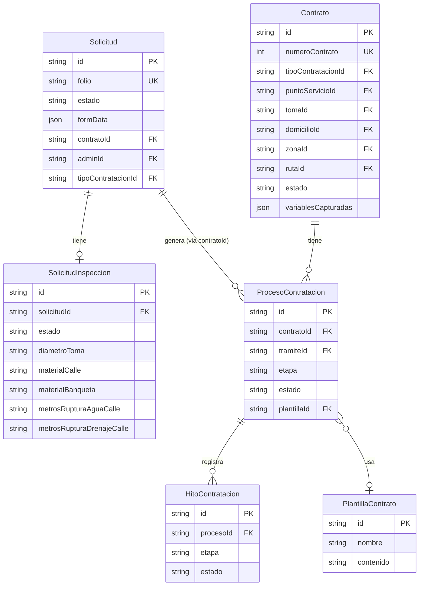
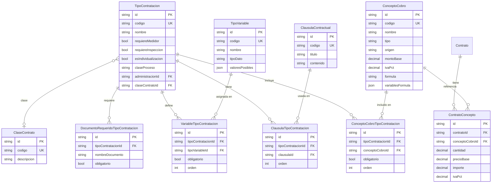
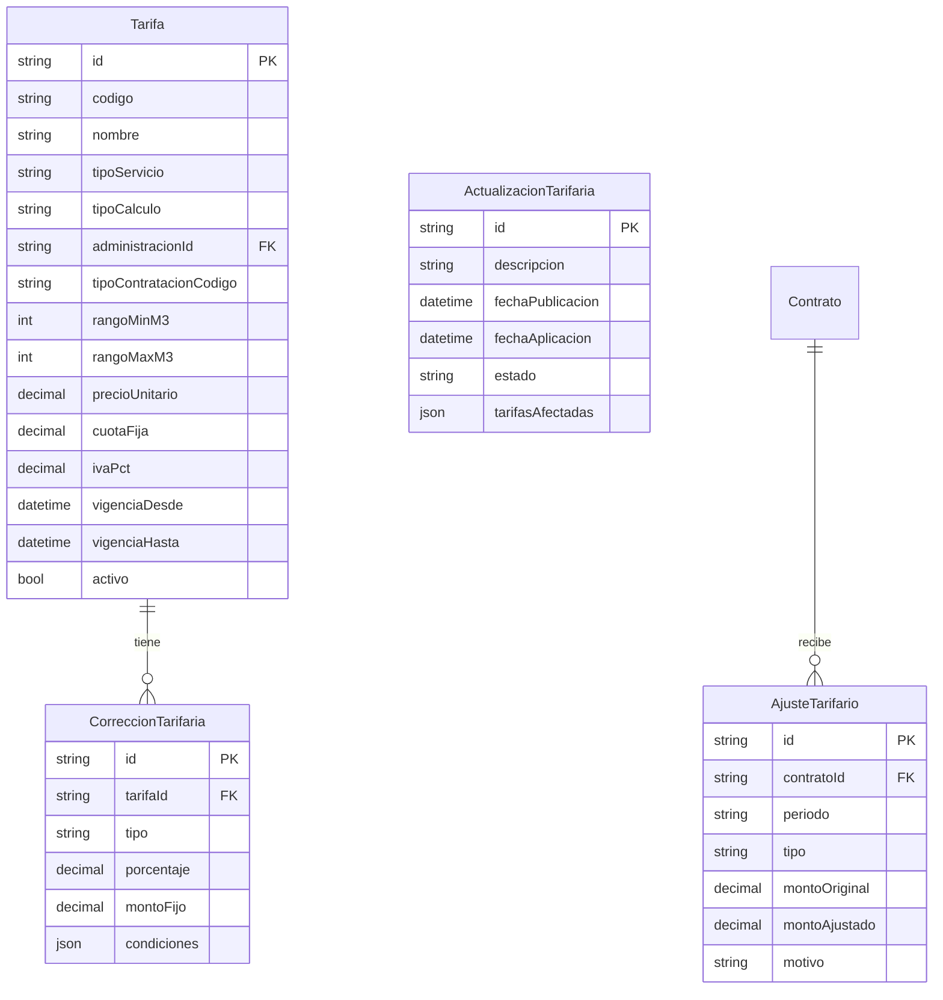
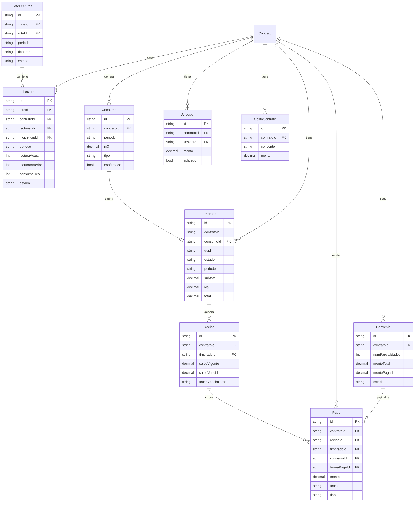
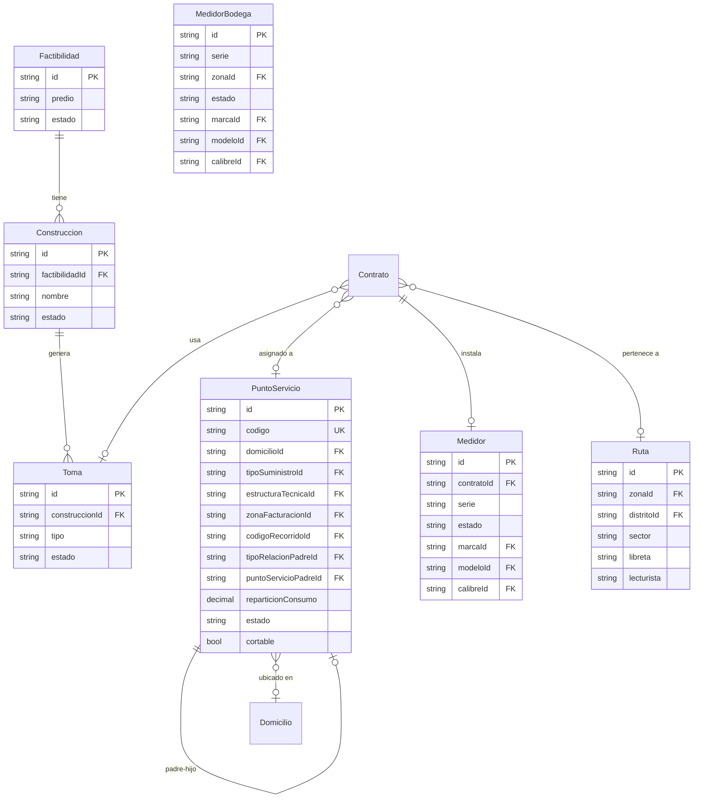
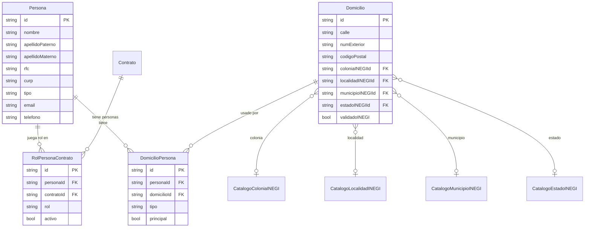
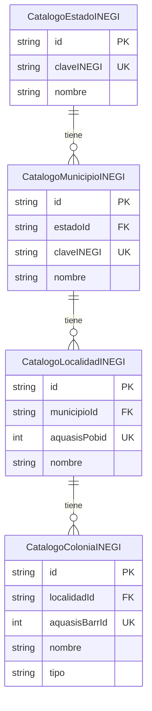
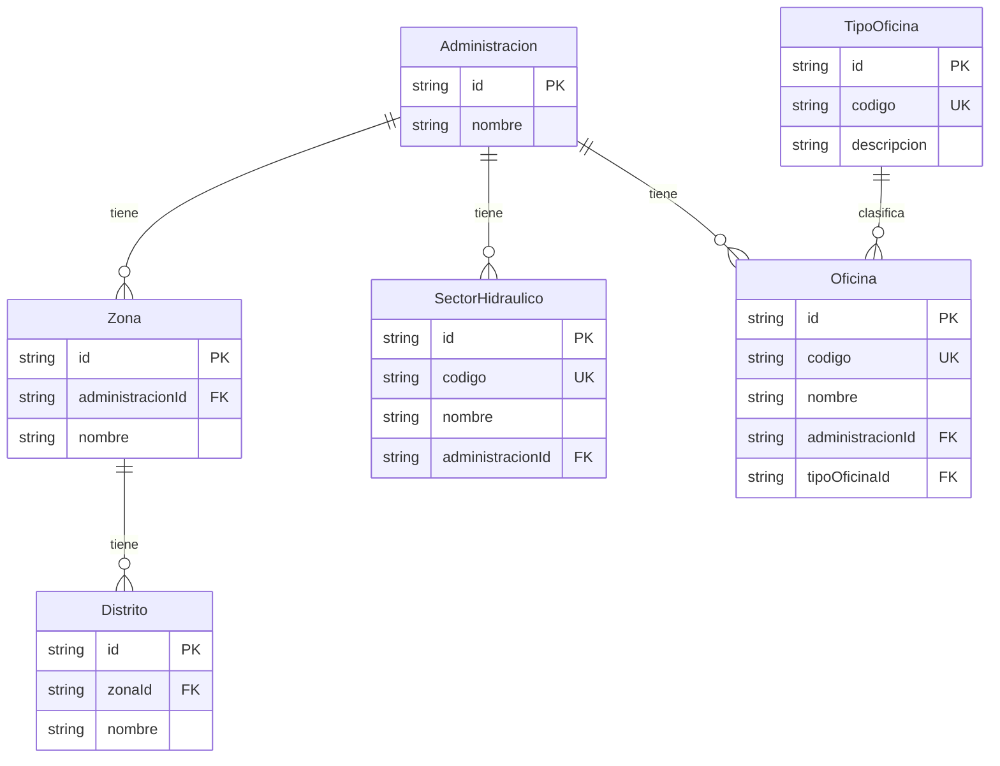
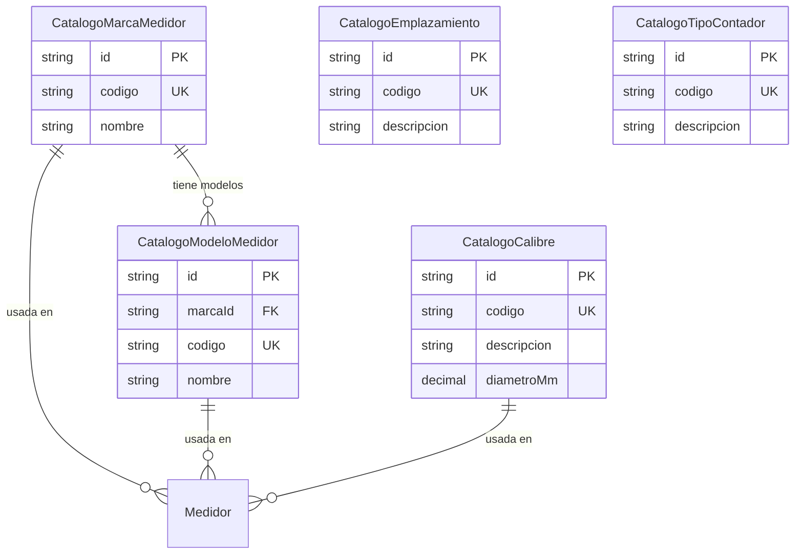
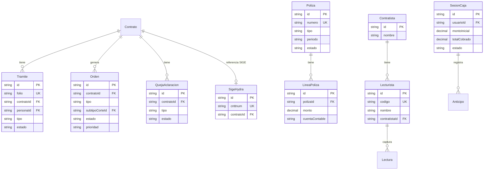

# MER — Sistema Hydra (CEA Querétaro)

> Generado: 2026-04-27  
> Base de datos: `hydra` (PostgreSQL 35.188.238.10:5433)

---

## Diagrama Entidad-Relación (Mermaid)

El esquema se agrupa en 10 dominios. Para legibilidad, el ERD completo se divide por dominio.

---

### 1. Flujo Principal: Solicitud → Contrato



---

### 2. Tipos de Contratación y Catálogos del Contrato



---

### 3. Motor Tarifario



> **Nota:** `Tarifa` se filtra en runtime por `tipoServicio` + `tipoContratacionCodigo` + `administracionId` + rango de vigencia. No hay FK directa hacia `TipoContratacion` — el join es por `codigo` string.

---

### 4. Medición y Facturación



---

### 5. Infraestructura Física



---

### 6. Personas y Domicilios



---

### 7. Catálogos Territoriales (Aquasis / INEGI)



> **Fuente de datos:** Aquasis (CEA Querétaro)  
> - `aquasisPobid` → ID de pobproid en tabla Localidad Población de Aquasis (filtro 1-18 municipios QRO)  
> - `aquasisBarrId` → barrId de tabla Colonia Barrio de Aquasis  
> - Relación colonia→localidad colapsa la tabla intermedia Localidad; `localidadId` apunta directo a `aquasisPobid`

---

### 8. Territorial Operativo



---

### 9. Catálogos de Medidores



---

### 10. Operaciones, Trámites y Otros



---

## Resumen de Modelos por Dominio

| Dominio | Modelos |
|---------|---------|
| **Flujo solicitud→contrato** | Solicitud, SolicitudInspeccion, ProcesoContratacion, HitoContratacion, PlantillaContrato |
| **Contrato** | Contrato, CostoContrato, ContratoConcepto, HistoricoContrato |
| **Tipos contratación** | TipoContratacion, TipoVariable, VariableTipoContratacion, ConceptoCobro, ConceptoCobroTipoContratacion, ClausulaContractual, ClausulaTipoContratacion, DocumentoRequeridoTipoContratacion, ClaseContrato |
| **Motor tarifario** | Tarifa, CorreccionTarifaria, AjusteTarifario, ActualizacionTarifaria |
| **Medición / Facturación** | LoteLecturas, Lectura, Consumo, Timbrado, Recibo, Pago, Convenio, Anticipo |
| **Infraestructura** | PuntoServicio, Toma, Construccion, Factibilidad, Medidor, MedidorBodega, Ruta |
| **Personas / Domicilios** | Persona, RolPersonaContrato, DomicilioPersona, Domicilio |
| **Catálogos Aquasis/INEGI** | CatalogoEstadoINEGI, CatalogoMunicipioINEGI, CatalogoLocalidadINEGI, CatalogoColoniaINEGI |
| **Territorial operativo** | Administracion, Zona, Distrito, SectorHidraulico, Oficina, TipoOficina |
| **Catálogos medidores** | CatalogoMarcaMedidor, CatalogoModeloMedidor, CatalogoCalibre, CatalogoEmplazamiento, CatalogoTipoContador |
| **Catálogos PS** | CatalogoTipoSuministro, CatalogoEstructuraTecnica, CatalogoZonaFacturacion, CatalogoCodigoRecorrido, CatalogoTipoRelacionPS, CatalogoTipoCorte |
| **Catálogos contrato** | CatalogoActividad, CatalogoGrupoActividad, CatalogoCategoria, CatalogoSat, FormaPago |
| **Trámites / docs** | Tramite, SeguimientoTramite, Documento, CatalogoTramite |
| **Operaciones** | Orden, SeguimientoOrden, QuejaAclaracion, SeguimientoQueja |
| **Caja / pagos externos** | SesionCaja, PagoExterno |
| **SAP / Contabilidad** | ReglaContable, Poliza, LineaPoliza |
| **GIS / Monitoreo** | LogSincronizacion, CambioGIS, LogProceso, ConciliacionReporte |
| **Lecturistas** | Contratista, Lecturista, CatalogoIncidencia, MensajeLecturista |
| **Auth / integración** | User, SigeHydra, AgoraTicket, MensajeRecibo |

---

## Relaciones Clave del Contrato

El modelo `Contrato` es el hub central. Sus FKs principales:

```
Contrato
├── tipoContratacionId → TipoContratacion
├── puntoServicioId    → PuntoServicio
├── tomaId             → Toma
├── domicilioId        → Domicilio
├── zonaId             → Zona
├── rutaId             → Ruta
├── actividadId        → CatalogoActividad
├── categoriaId        → CatalogoCategoria
│
├── [1:1] medidor       → Medidor
├── [1:N] personas      → RolPersonaContrato → Persona
├── [1:N] consumos      → Consumo → Timbrado → Recibo → Pago
├── [1:N] ordenes       → Orden
├── [1:N] tramites      → Tramite
├── [1:N] convenios     → Convenio
├── [1:N] conceptos     → ContratoConcepto → ConceptoCobro
└── [1:N] procesos      → ProcesoContratacion → HitoContratacion
```

## Motor Tarifario — Notas

`Tarifa` **no** tiene FK directa a `TipoContratacion`. El join es dinámico en runtime vía:
- `tarifas.tipo_contratacion_codigo` = `tipos_contratacion.codigo`
- `tarifas.administracion_id` (opcional)
- `tarifas.vigencia_desde / vigencia_hasta` (fecha efectiva)
- `tarifas.rango_min_m3 / rango_max_m3` (para escalonado)

Para cotizaciones, el motor en `lib/tarifas.ts` (`calcularCotizacion`) también lee los `ConceptoCobro` con `formula` y `variablesFormula` para calcular montos de instalación basados en variables capturadas (METROS_TOMA, DIAMETRO_TOMA, etc.).
